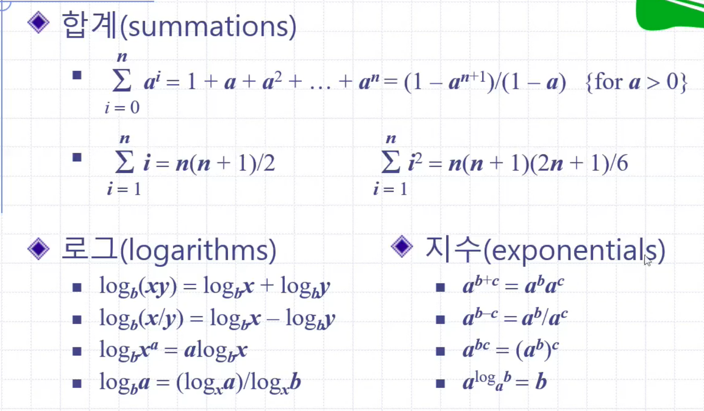

# 알고리즘 분석
알고리즘의 성능은 크게 **실행 시간**과 **기억장치 사용량**으로 측정한다.

알고리즘의 실행시간은 대채로 입력의 크기에 비례한다. 평균 실행 시간<sup>average case running time</sup>은 산출하기 어렵다. 그렇기에 최악 실행 시간<sup>worst case running time</sup>에 집중한다.

## 실험적 방법
알고리즘의 실행시간을 **실험적 방법**으로 직접 제어 보며 구할 수도 있다. 좋은 알고리즘은 보통 입력에 대해 실행시간이 선형적으로 증가한다.

실험적 방법은 비교적 정확한 알고리즘 실행시간을 알 수 있지만, 실험에 포함되지 않은 입력에 대한 실행시간을 반영할 수 없고, 하드웨어나 소프트웨어의 변화에 따라 다른 결과가 날 수 있다. 또한, 알고리즘을 실제로 구현하기 전에는 테스트가 불가능하다.

## 복잡도 계산<sup>Calculating Complexity</sup>
복잡도 계산은 **이론적 방법**으로, 하드웨어나 소프트웨어와 무관하게 알고리즘의 성능을 측정할 수 있고, 프로그램이 실제하지 않아도 성능을 분석할 수 있다.

### 의사코드<sup>pseudo-code</sup>
알고리즘을 설명하기 위한 고급언어, 자연어 보다는 구조적이지만 프로그래밍 언어보단 덜 상세함.

알고리즘의 설명에 많이 사용됨

```pseudo
Alg arrayMax(A,n)
    input array A of n integers
	output maximum element of A
	curMax <- A[0]
	for i <- 1 to n-1
		if (A[i] > curMax)
			curMax <- A[i]
	return curMax
```

### 원시작업<sup>primitive operations</sup>
|구분|작업 종류|
|----|--|
|산술식/논리식의 평가|EXP|
|변수에 특정값을 치환|ASS|
|배열원소 접근|IND|
|함수 호출|CAL|
|함수의 반환|RET|

의사코드를 조사하여 알고리즘에 의해 실행되는 원시작업의 최대 개수를 입력크기에 대한 함수 형태로 결정할 수 있다.


## 실행시간 추정
최악의 경우에 원시작업 7n-2개를 실행하는 알고리즘에서 아래와 같이 정의하자.

- a = 가장 빠른 원시작업 실행에 걸리는 시간
- b = 가장 느린 원시작업 실행에 걸리는 시간

이때, 알고리즘의 실행시간 T(n)을 알고리즘의 최악인 경우의 시간이라 가정하면, 아래가 성립한다.


T(n)은 선형 함수 a와 b 사이에 껴있다.

이제 소프트웨어나 하드웨어 환경을 변경하면, T(n)에 상수 배수 만큼의 영향을 주지만, 증가율은 변화하지 않는다.

즉, 선형의 **증가율**을 나타내는 실행시간 T(n)은 해당 알고리즘의 고유 속성이다.

## Big-O와 증가율
Big-O 표기볍은 함수의 증가율의 **상한**을 나타낸다.


위 식은 f(n)의 증가율이 g(n)을 넘지 않음을 의미한다.

### 예시
주어진 두 개의 함수 `f`와 `g`에 대해, 만약 모든 정수 n≥n<sub>0</sub>에 대해 `f(n) ≤ c⋅g(n)` 이 성립하는 실수의 상수 `c > 0` 및 정수의 상수 n<sub>0</sub>≥1가 존재하면, `f(n) = O(g(n))`이라고 한다.

### Big-O 계산 요령
- f(n)이 상수이면 f(n) = O\(c\), 또는 O(1)
- f(n)이 차수 d의 다항식이면, f(n) = O(n<sup>d</sup>)
- 최소한의 함수 계열을 사용
	- 2n = O(n<sup>2) 대신 2n = O(n) 사용
- 해당 함수계열 중 가장 단순한 표현 사용
	- O(3n) 대신 O(n)

## 점근분석<sup>asymptotic analysis</sup>
알고리즘을 점근분석하여 big-O 표기법에 의한 실행시간을 구할 수 있다.

1. 최악의 원시작업 실행회수를 입력크기의 함수로서 구한다.
2. 이 함수를 big-O 표기법으로 나타낸다.

이때, 상수계수와 낮은 차수의 항들은 결국 탈락되므로, 원시작업 수를 계산할 때 이를 생략하면 편하다.

- 다중의 원시작업은 상수 시간이 소요되므로 원시작업 하나로 계산 가능
- 반복문이 중요하다. 중첩 될수록 계수 1씩 증가.
- 조건문에서는 if-else 절 중 **실행시간이 큰 것**을 취함 

## 전형적인 증가율
|함수|이름|f(10<sup>2</sup>)|f(10<sup>3</sup>)|f(10<sup>4</sup>)|
|--|---|--|--|--|
|c|상수|1|1|1|
|log n|로그|7|10|14|
|log<sup>2</sup> n|로그 제곱|49|100|200|
|n|선형|100|1000|10000|
|n log n|로그 선형|700|10000|140000|
|n<sup>2</sup>|2차|10000|10<sup>6</sup>|10<sup>8</sup>|
|2<sup>n</sup>|지수|10<sup>30</sup>|10<sup>300</sup>|10<sup>3000</sup>

## 수학적 배경


## 자료구조용어들
|Term|Meaning|
|--|----|
|RAM|Random Access Machine, 어디에 접근해도 같은 상수시간이 소요되는 메모리|
|원시작업<sup>primitive operations</sup> | RAM에 상수 시간 접근하여 수행한다고 생각되는 작업 (값 치환, 열람, 비교 등)

