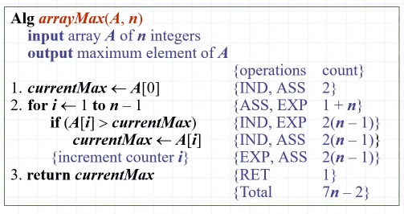

# 알고리즘 분석
알고리즘의 성능은 크게 **실행 시간**과 **기억장치 사용량**으로 측정한다.

알고리즘의 실행시간은 대채로 입력의 크기에 비례한다. 평균 실행 시간<sup>average case running time</sup>은 산출하기 어렵다. 그렇기에 최악 실행 시간<sup>worst case running time</sup>에 집중한다.

## 실험적 방법
알고리즘의 실행시간을 **실험적 방법**으로 직접 제어 보며 구할 수도 있다. 좋은 알고리즘은 보통 입력에 대해 실행시간이 선형적으로 증가한다.

실험적 방법은 비교적 정확한 알고리즘 실행시간을 알 수 있지만, 실험에 포함되지 않은 입력에 대한 실행시간을 반영할 수 없고, 하드웨어나 소프트웨어의 변화에 따라 다른 결과가 날 수 있다. 또한, 알고리즘을 실제로 구현하기 전에는 테스트가 불가능하다.

## 복잡도 계산<sup>Calculating Complexity</sup>
복잡도 계산은 **이론적 방법**으로, 하드웨어나 소프트웨어와 무관하게 알고리즘의 성능을 측정할 수 있고, 프로그램이 실제하지 않아도 성능을 분석할 수 있다.

### 의사코드<sup>pseudo-code</sup>
알고리즘을 설명하기 위한 고급언어, 자연어 보다는 구조적이지만 프로그래밍 언어보단 덜 상세함.

알고리즘의 설명에 많이 사용됨

```pseudo
Alg arrayMax(A,n)
    input array A of n integers
	output maximum element of A
	curMax <- A[0]
	for i <- 1 to n-1
		if (A[i] > curMax)
			curMax <- A[i]
	return curMax
```

## 자료구조용어들
|Term|Meaning|
|--|----|
|RAM|Random Access Machine, 어디에 접근해도 같은 상수시간이 소요되는 메모리|
|원시작업<sup>primitive operations</sup> | RAM에 상수 시간 접근하여 수행한다고 생각되는 작업 (값 치환, 열람, 비교 등)

의사코드를 조사하여 알고리즘에 의해 실행되는 원시작업의 최대 개수를 입력크기에 대한 함수 형태로 결정할 수 있다.

